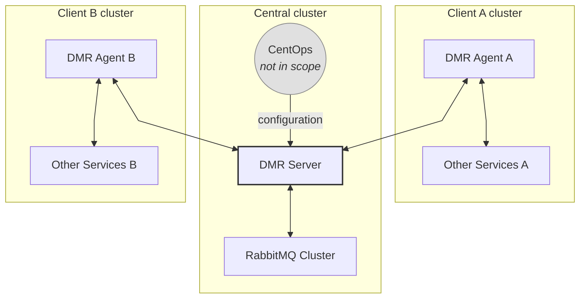

# DMR (Distributed Message Rooms)

## Business case

Currently, there is no way to pass questions from one Bürokratt instance to another. This means that if an end-user asks a question that the local Bürokratt instance cannot answer, he will receive no meaningful reply — even if some other Bürokratt instance could answer it.

An example: a user comes to the Tax Authority web, and asks a question about crime, the Tax Authority instance will not be able to answer it. The Police instance **is able** to answer the question but there is no way to forward it.

So the goal is to built a system that can efficiently and securely forward questions and answers between Bürokratt instances.

## Architecture chart



## Key components

### DMR agents

- **DMR agents** run in every client's Bürokratt cluster. They are responsible for forwarding messages to the DMR Server and receiving messages from it in real-time. This is done via a WebSocket connection.
- TODO NOT YET READY

### DMR server

- Key functionality is to forward the messages between DMR agents using RabbitMQ.
- Uses WebSockets to exchange messages with DMR agents.
- Gets its configuration from CentOps. CentOps is developed separately and is out of scope for this project.
- Can also distribute configuration to DMR agents if necessary, namely public keys.
- DMR server _itself_ is lightweight and stateless, it does not store any messages or configuration data in any sort of a DB.
- **Cannot** read the message contents, these are encrypted by the DMR agents.
- There can be several instances of DMR server running, depending on load.
- In the future, can potentially be extended to perform operations — like applying policies — on incoming and outgoing messages.

### RabbitMQ

- Has per-Agent message queues. To do: or not?
- Has a dead letter queue for messages that failed to deliver.
- Has RabbitMQ UI-based monitoring tools set up.
- Supports RabbitMQ clustering for scalability.

## Outdated info

⚠️ The data below is outdated. It is here for historical purposes only, please **do not** use it for development.

> _This document is in a status of "In Progress"_

### About

DMR (short for Distributed Message Rooms) is used as a central _proxy_ to exchange communication between Bürokratt Core and different Bürokratt Instances, but also between different Bürokratt Instances themselves.

### User stories

#### Remote software update

```
AS Bürokratt Core
I WANT all Bürokratt Instances to update their Bürokratt-related software based on input provided by us
SO THAT I could be confident that all participants of Bürokratt Network are working on up-to-date software
```

```
AS A Bürokratt Instance
I WANT my Bürokratt-related software to be always up-to-date without requiring any participation from my side
SO THAT I wouldn't need technical team to keep Bürokratt up and running
```

#### Remote observability

```
AS Bürokratt Core
I WANT TO have non-intrusive overview of Bürokratt-related technical stack and their performance of Instances part of Bürokratt Network
SO THAT I could react proactively in case of detecting problems
```

```
AS AN Instances of Bürokratt
I WANT Bürokratt Core to have non-intrusive overview of my technical stack and its performance
SO THAT they could take action to fix the problems when necessary
```

#### Forwarding messages to appropriate participants

```
AS Estonia
I WANT Estonians to get answers and e-services from one entry-point
SO THAT they wouldn't have to use different platforms and service providers
```

```
AS AN Instance of Bürokratt Network
I WANT End Clients to get answers to their questions served by other Instances of Bürokratt Network
SO THAT I wouldn't have to find the answers manually
```

### Architecture

#### Concept backed with POC

<https://github.com/buerokratt/DMR.NET/blob/main/docs/design-architecture-for-dmr-related-services.doc.md>

<https://github.com/buerokratt/POC-DMR.Nginx>

#### Initial concept

<https://koodivaramu.eesti.ee/buerokratt/architecture/concepts-and-proof-of-concepts/-/tree/master/Distributed%20Message%20Rooms>

### Related links

[GitHub Project for POC development](https://github.com/orgs/buerokratt/projects/3/views/1)
